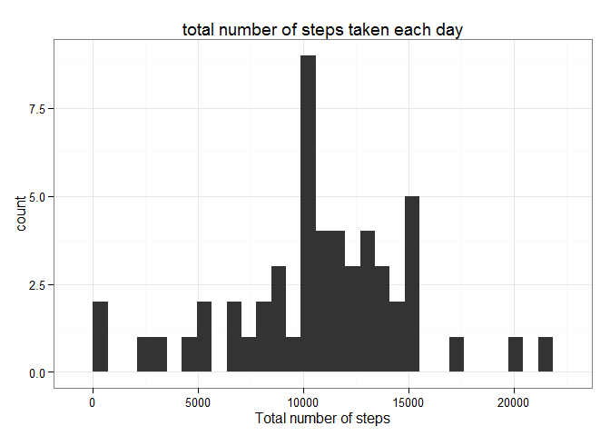
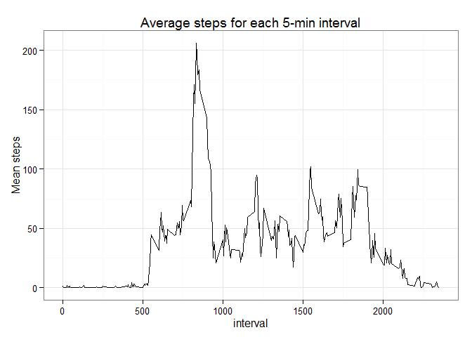
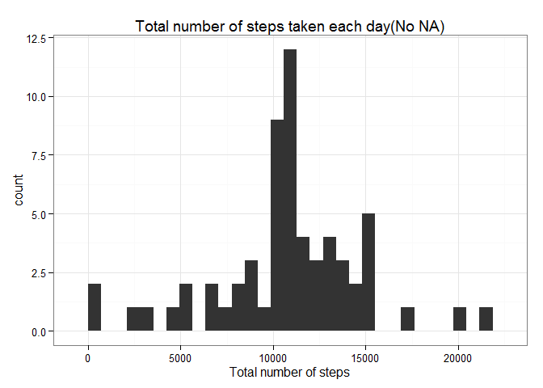
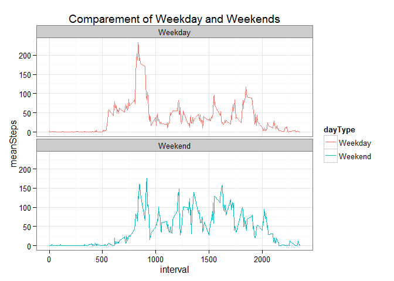

# Reproducible Research: Peer Assessment 1


## Loading and preprocessing the data
load the essiential packages

```r
library(ggplot2)
```

```
## Warning: package 'ggplot2' was built under R version 3.2.1
```

```r
library(data.table)
```

```
## 
## Attaching package: 'data.table'
## 
## The following object is masked _by_ '.GlobalEnv':
## 
##     .N
```
read data from my working directary

```r
df <- read.csv("activity.csv",stringsAsFactors=FALSE)
dt <- data.table(df)
```
process the data 

```r
dt$date <- as.Date(dt$date)
setkey(dt, date, interval)
```

## What is mean total number of steps taken per day?
Congrugate the steps by day

```r
steps_day <- dt[, list(totalsteps = sum(steps)), date]
```
Plot "total number of steps taken each day"


```r
ggplot(steps_day,aes(x=totalsteps)) + geom_histogram() +  
xlab("Total number of steps") +
ggtitle("total number of steps taken each day")+ theme_bw()
```

```
## stat_bin: binwidth defaulted to range/30. Use 'binwidth = x' to adjust this.
```

 
 

Calculate the mean and median total number of steps taken per day

```r
median(steps_day$totalsteps,na.rm = TRUE)
```

```
## [1] 10765
```

```r
mean(steps_day$totalsteps,na.rm = TRUE)
```

```
## [1] 10766.19
```

## What is the average daily activity pattern?
Make the plot of Average steps for each 5-min interval across the day

```r
avr_int<- dt[, list(meanSteps = mean(steps, na.rm=TRUE)), interval]
ggplot(avr_int, aes(x=interval, y=meanSteps)) +
geom_line() + ggtitle("Average steps for each 5-min interval")+
ylab("Mean steps") + theme_bw()
```

 

Which 5-minute interval, on average across all the days in the dataset, contains the maximum number of steps?

```r
avr_int[which(meanSteps==max(meanSteps)),interval]
```

```
## [1] 835
```

## Imputing missing values
Calculate and report the total number of missing values in the dataset

```r
sum(is.na(dt$steps))
```

```
## [1] 2304
```
I choose to use the mean for that 5-minute interval for the NAs in the steps

```r
dt_nna <- dt

for (i in 1:nrow(dt_nna)) {
  if (is.na(dt_nna$steps[i])) {
    dt_nna$steps[i] <- avr_int[which(dt_nna$interval[i] == avr_int$interval), ]$meanSteps
  }
}
```
Make a histogram of the total number of steps taken each day

```r
newsteps_day <- dt_nna[, list(totalsteps = sum(steps)), date]
ggplot(newsteps_day,aes(x=totalsteps)) + geom_histogram() +  
  xlab("Total number of steps") +
  ggtitle("Total number of steps taken each day(No NA)")+ theme_bw()
```

```
## stat_bin: binwidth defaulted to range/30. Use 'binwidth = x' to adjust this.
```

 

Calculate and report the mean and median total number of steps taken per day

```r
median(newsteps_day$totalsteps)
```

```
## [1] 10766.19
```

```r
mean(newsteps_day$totalsteps)
```

```
## [1] 10766.19
```
The former median value is 10765,the later median value is 10766.19
The former mean value is 10766.19,the later mean value is 10766.19
After calculation,I find that the median value is greater than it was before,and the mean value is the same.

## Are there differences in activity patterns between weekdays and weekends?
Create a new factor variable in the dataset with two levels – “weekday” and “weekend” indicating whether a given date is a weekday or weekend day.

```r
Sys.setlocale("LC_TIME", "English")
```

```
## [1] "English_United States.1252"
```

```r
wk_byday <- c("Sunday", "Monday", "Tuesday", "Wednesday", "Thursday", "Friday", "Saturday")

wk_bytype <- c("Weekend", rep("Weekday", 5), "Weekend")
dt <- dt[, dayOfWeek := factor(weekdays(date), levels=wk_byday)]
dt <- dt[, dayType := factor(wk_bytype[dayOfWeek])]
dt[, .N, list(dayType, dayOfWeek)]
```

```
##    dayType dayOfWeek    N
## 1: Weekday    Monday 2592
## 2: Weekday   Tuesday 2592
## 3: Weekday Wednesday 2592
## 4: Weekday  Thursday 2592
## 5: Weekday    Friday 2592
## 6: Weekend  Saturday 2304
## 7: Weekend    Sunday 2304
```

```r
dtIntervals <- dt[, list(meanSteps = mean(steps, na.rm=TRUE)), list(dayType, interval)]
```
Make a panel plot containing a time series plot (i.e. type = "l") of the 5-minute interval (x-axis) and the average number of steps taken, averaged across all weekday days or weekend days (y-axis). See the README file in the GitHub repository to see an example of what this plot should look like using simulated data.

```r
ggplot(dtIntervals, aes(x=interval, y=meanSteps, color=dayType)) +
  geom_line() +
  facet_wrap(~ dayType, nrow=2) +
  ggtitle("Comparement of Weekday and Weekends")+
  theme_bw()
```

 

